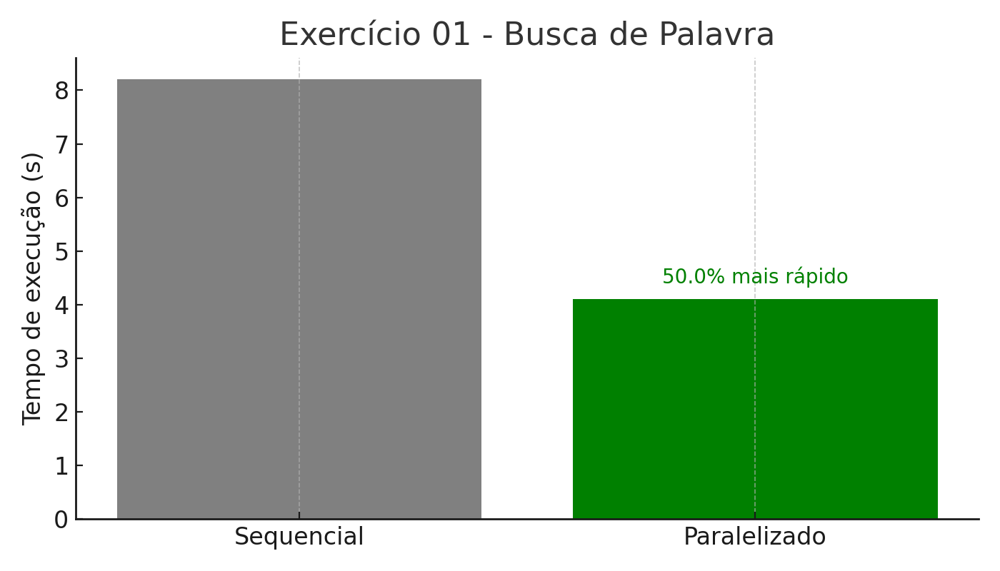

# web-crawler-threaded

Buscando palavras em um site (crawler com threads)

**Arquivos:**
- `Exercicio02-Base.py`
- `exerc02-Resolvido.py`

**Como usar no Google Colab:**
1. Faça upload dos dois arquivos no painel lateral do Colab.
2. Execute primeiro o `Exercicio02-Base.py` (define a estrutura original do crawler).
3. Em seguida, execute o `exerc02-Resolvido.py` (com paralelização por threads).
4. O código pedirá uma **URL** e a **palavra-chave** a ser buscada nas páginas.
5. O tempo de execução com threads será exibido no final do processo.

